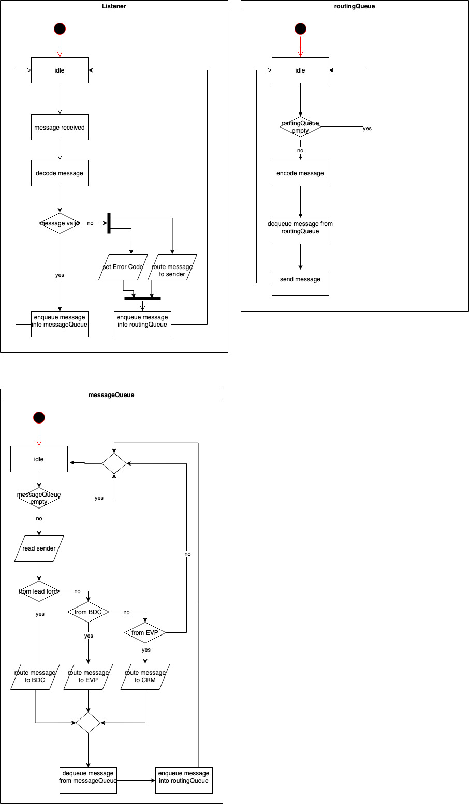

<!--
SPDX-License-Identifier: MIT
SPDX-FileCopyrightText: 2023 Simon Zimmermann
SPDX-FileCopyrightText: 2023 Berkay Bozkurt <resitberkaybozkurt@gmail.com>
-->

# Automation

The _Controller_ is a planned component, that has not been implemented beyond a
conceptual prototype. In the planned scenario, the controller would coordinate
BDC, MSP and the external components as a centralized instance of control. In
contrast to our current design, this scenario would enable the automation of our
current workflow, where there are currently several steps of human interaction
required to achieve a prediction result for initially unprocessed lead data.

## Diagrams

The following diagrams were created during the prototyping phase for the
Controller component. As they are from an early stage of our project, the
Merchant Size Predictor is labelled as the (Estimated) Value Predictor here.

### Component Diagram

### Sequence Diagram

### Controller Workflow Diagram

