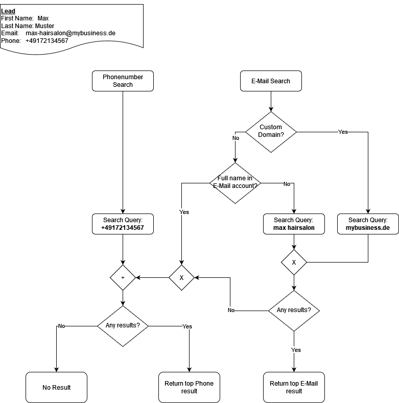

<!--
SPDX-License-Identifier: MIT
SPDX-FileCopyrightText: 2023 Lucca Baumgärtner <lucca.baumgaertner@fau.de>
-->

# Google Search Strategy

## Introduction

In order to gather more information about a lead, we query the Google Places API. The API has
multiple endpoints, enabling different search method. To have the best chances at correctly identifying a lead
we try to combine the search methods and derive the most probable result.

### Available Lead Information

| First Name | Last Name | Phone Number  | Email                        |
| ---------- | --------- | ------------- | ---------------------------- |
| Max        | Muster    | +491721234567 | max-muster@mybusiness.com    |
| Melanie    | Muster    | +491322133321 | melanies-flowershop@gmail.nl |
| ...        | ...       | ...           | ...                          |

### Available Search Methods

1. Fulltext Search
2. Phone Number Search

## Search Strategy

1. Phone Number Search 2) If there's a valid phone number, look it up
2. Email Based Search 3) If there's a custom domain, look it up 4) Else: Unless it contains the full name, look up the E-Mail account (everything before the `@` sing)
3. If Email-based Search returned any results, use those
4. Else: Return Phone-based search results
5. Else: Return nothing

